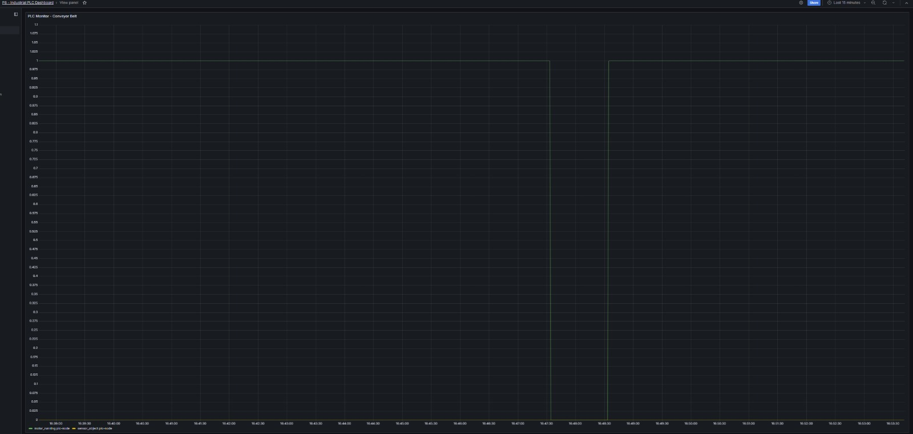
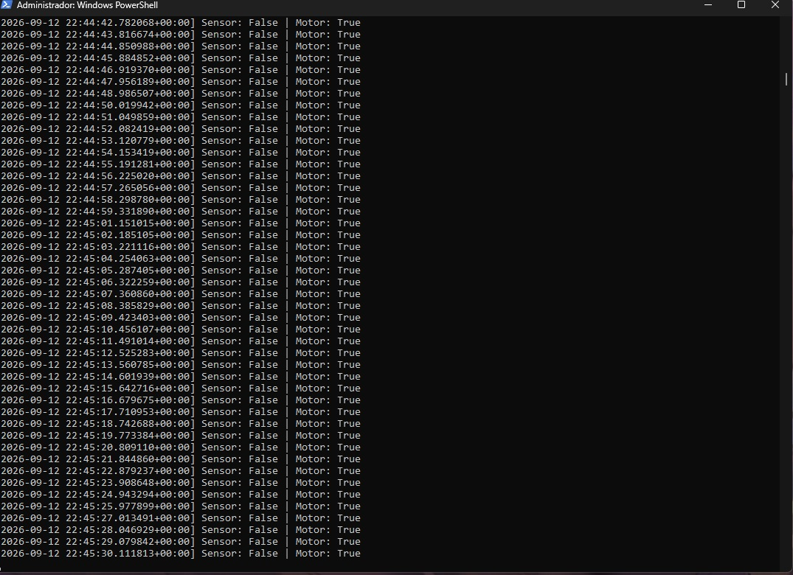

# Project 8 — InfluxDB Industrial PLC Dashboard

Real-time PLC data pipeline replacing SQLite with InfluxDB 2.7 for concurrent read/write support. Signals from a CODESYS SoftPLC are read via Modbus TCP, stored in InfluxDB, and visualized in Grafana.

---

## Architecture

```
CODESYS SoftPLC (SP17)
        |
    Modbus TCP (port 502)
        |
   Python Script
   (pymodbus + influxdb-client)
        |
   InfluxDB 2.7
   (bucket: plc_data)
        |
     Grafana 10
   (dashboard: PLC Monitor)
```

---

## Signals

| Signal | Type | Modbus Address | Description |
|---|---|---|---|
| sensor_object | Coil | 0 | Object detected on belt |
| motor_running | Discrete Input | 0 | Conveyor motor status |

---

## Tools & Software

| Tool | Version |
|---|---|
| CODESYS Control Win | V3.5 SP17 |
| Python | 3.14 |
| pymodbus | 3.13 |
| influxdb-client | 1.50.0 |
| InfluxDB | 2.7.11 |
| Grafana | 10.4.3 |
| OS | Windows 11 |

---

## How to Run

**1. Start InfluxDB**
```
cd C:\influxdb2
.\influxd.exe
```

**2. Start CODESYS SoftPLC**

Open `P5_project` in CODESYS → Login → Run.

**3. Run the Python script**
```
python plc_influxdb_monitor.py
```

**4. Open Grafana**

Navigate to `http://localhost:3000` and open the `P8 - Industrial PLC Dashboard`.

---

## Screenshots




---

## Troubleshooting

**InfluxDB 3 Core + Grafana 10 — TLS handshake error**
InfluxDB 3 Core uses FlightSQL over gRPC with mandatory TLS for its SQL query mode. Grafana 10's InfluxDB datasource cannot connect to it without TLS configured. Downgraded to InfluxDB 2.7, which uses a standard HTTP API fully compatible with Grafana 10.

**Grafana 13 — influxdbBackendMigration hardcoded**
The feature flag `influxdbBackendMigration = true` is hardcoded in Grafana 13's binary and cannot be overridden via `custom.ini`. Downgraded to Grafana 10.4.3 to restore normal InfluxQL/Flux connectivity.

**CODESYS SP17 — lost device credentials**
After 2–3 months without use, device login credentials were forgotten. Reset by deleting `.UserDatabase.csv` and `.UserDatabase.csv_` from `C:\ProgramData\CODESYS\CODESYSControlWinV3x64\<UUID>\`. CODESYS regenerated the user database on next startup.

**Factory I/O — expired license**
Trial license expired. Factory I/O is not part of the data pipeline (CODESYS → Python → InfluxDB), so the dashboard was validated without it by reading live Modbus signals directly from the SoftPLC.

---

## Roadmap Context

- [x] Project 5 — Conveyor Belt Sensor Control (CODESYS + Modbus TCP + Factory I/O)
- [x] Project 6 — PLC Python Modbus Monitor (CSV logger)
- [x] Project 7 — Industrial PLC Dashboard (SQLite + Grafana)
- [x] Project 8 — InfluxDB Migration (this project)
- [ ] Project 9 — Industrial Data Quality Validation (SQL anomaly detection)
- [ ] Project 10 — IT/OT Network Architecture Documentation
- [ ] Project 11 — OPC UA (revisit license workaround)
